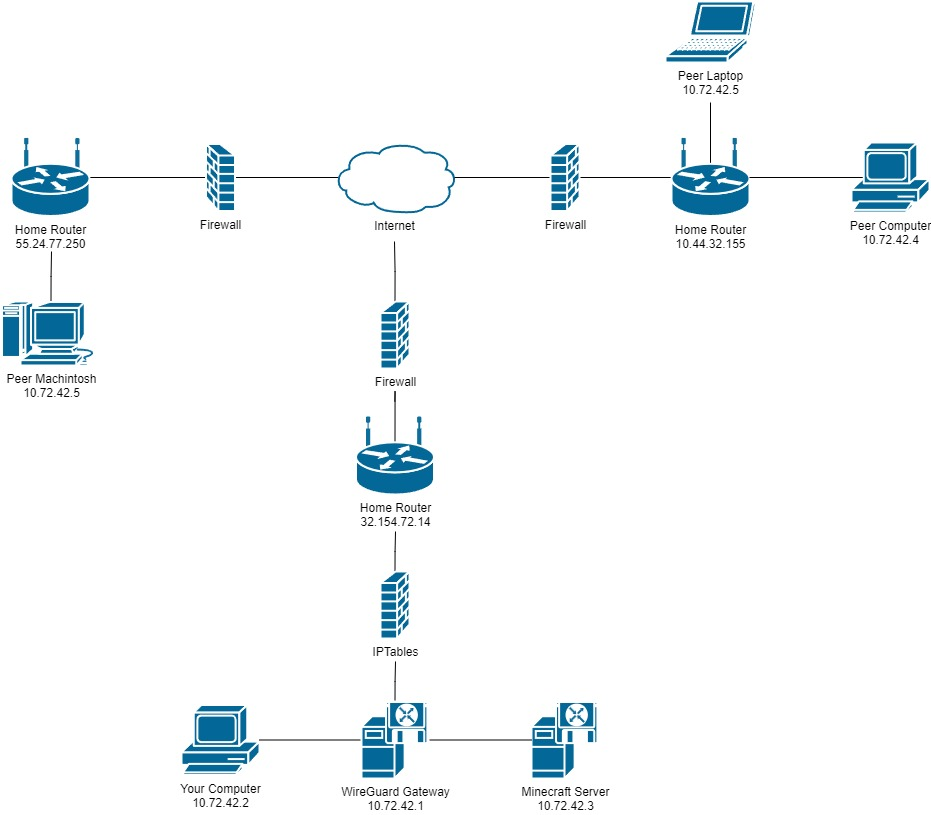
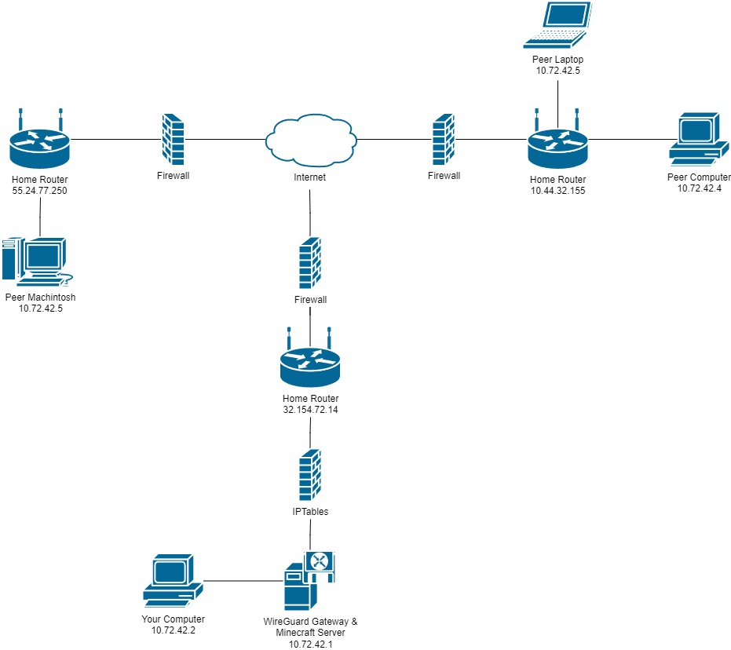
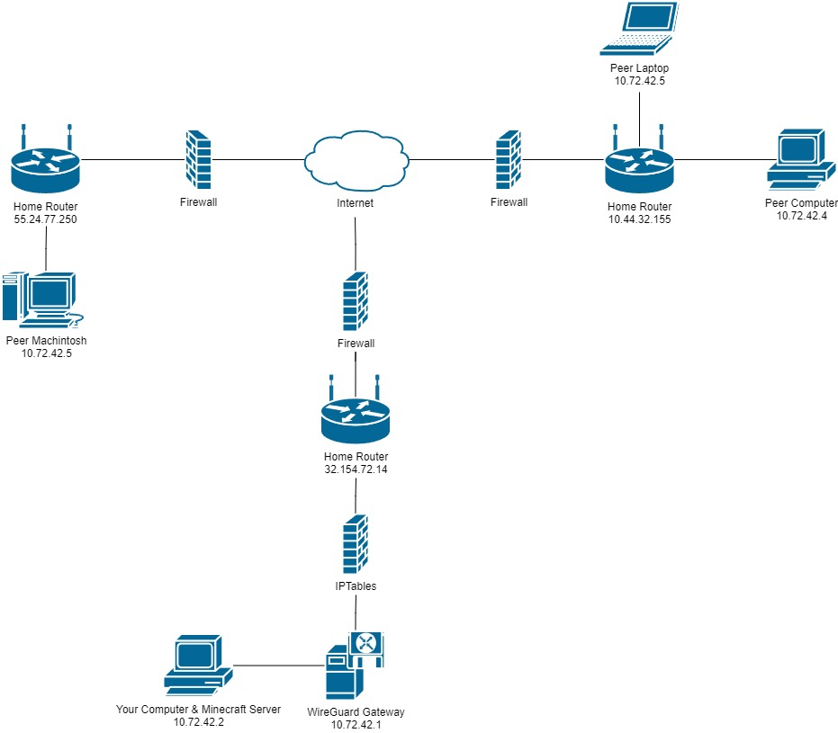
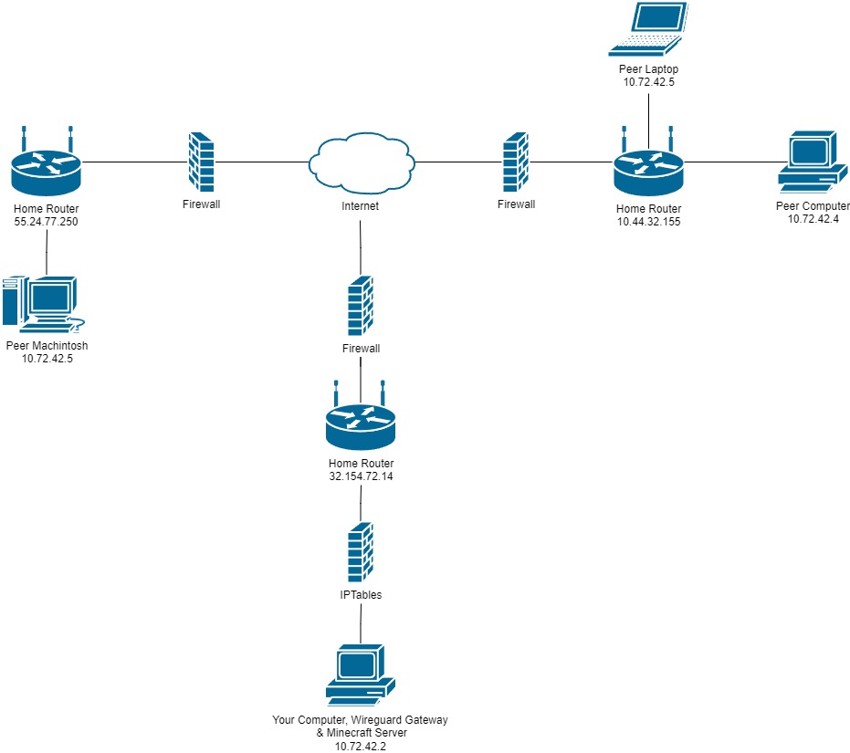
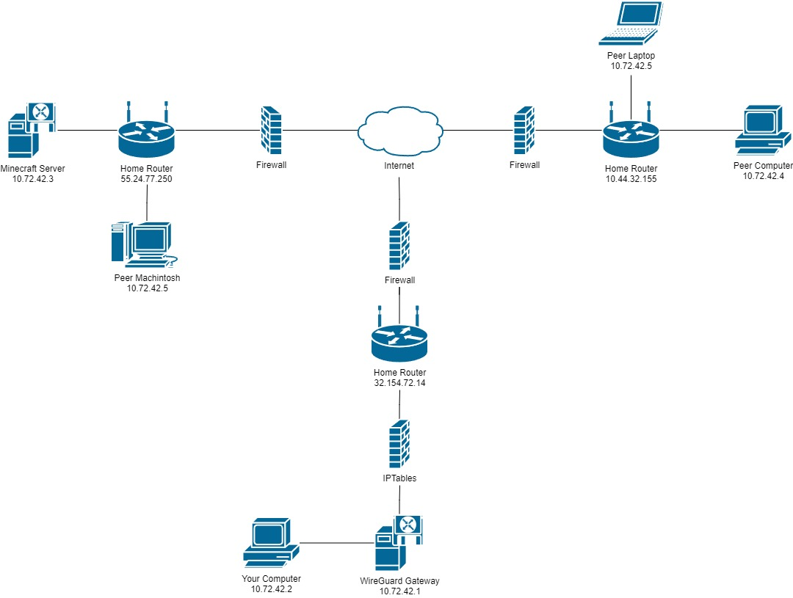

# How To Setup A Private Minecraft Server Using WireGuard 
<h2>Disclaimer  </h2>

> This guide is intended to provide information and guidance on how to setup a private Minecraft server using WireGuard. Every effort has been made to ensure that the information presented in this guide is as accurate as possible. Despite this, it is possible that some information in this guide may be inaccurate. I encourage people reading this guide to consult relevant online sources to enhance the guides accuracy and maybe learn more along the way. I have linked the sources used in this guide in the [footnotes](#footnotes) section and suggest going there for further reading. <3

## Table of Contents
 1. [Introduction](#introduction)
    1. [Purpose & Motivation](#purpose--motivation)
    2. [Target Audience](#target-audience)
    3. [Overview of Steps](#overview-of-steps)
    4. [Any Prerequisites or Requirements?](#any-prerequisites-or-requirements)
    5. [Encouragement & Direction](#encouragement--direction)
 2. [What is WireGuard?](#what-is-wireguard) 
    1. [Why WireGuard to Host a Minecraft Server?](#why-wireguard-to-host-a-minecraft-server)
    2. [Is WireGuard Safe?](#is-wireguard-safe)
    3. [How Does It Work?](#how-does-it-work)
    4. [Any Alternatives?](#any-alternatives)
    5. [Further Reading](#further-reading)
 3. [Choosing Server Topology](#server-topology)
    1. [Separated Servers]()
    2. [Combined Servers]()
    3. [Personal PC Host]()
    4. ["The Boy's Got Me" Topology]()
 4. [Setting Up The Operating System]()
    1. [Setting Up a Raspberry Pi](#sshing-into-your-pi)
    2. [Setting Up a Ubuntu Server]()
 5. [SSHing into your server]()
 6. [Setting Up WireGuard]()
    1. [WireGuard On Debian Based Operating Systems Using PiVPN]()
    2. [Manual WireGuard Setup]()
 7. [Creating Key Pairs]()
 8. [Distributing Key Pairs]()
 9. [Creating The Minecraft Server]()
    1. [Vanilla Server]()
    2. [Spigot Server]()
    3. [PaperMC Server]()
    4. [Modded Server]()
    5. [Modded Server Using CurseForge]()
 1. [DNS Configuration]()
    1. [PiHole]()
    2. [CloudFlare]()
 2. [Changes]()
 3. [Contributing]()
 4. [Footnotes]()

## Introduction
In this guide, I will cover how to create a private Minecraft server using PiVPN & WireGuard. This guide is meant for private Minecraft servers, using WireGuard to host a public Minecraft server is not recommended as there are better methods of doing that. If you are looking to host a public Minecraft server, consider hosting with a VPS or Paid Provider. This guide will cover everything from WireGuard basics, configuring the the operating system, deploying the minecraft server and more.

I have also uploaded a video on my YouTube channel in case you want to follow along in video format. Keep in mind that throughout the video you will have to refer back to specific parts of the guide so that you will have the most up to date information. The video also uses the recommended items and topology. For cases not covered in the video don't worry as they shouldn't differ too much from the video. 

### Purpose & Motivation ~
I utilized PiVPN and WireGuard when I was developing [StorageSolution](https://github.com/ShiroTohu/StorageSolution). **StorageSolution** is a full-stack application I developed that allowed the computers from [CC: Tweaked](https://tweaked.cc/) to display all the items in my storage system in a nice and presentable manner using Python [Textualize](https://www.textualize.io/). I created a backend API to distribute the contents of my storage system to the frontend where the end-user could then see the items in table format. Examples online showed backend solutions using [ngrok](https://ngrok.com/) that exposed the backend to the internet. This isn't something that I really wanted since anyone could establish a websocket connection with the server, therefore to limit the server's exposure I setup a WireGuard VPN in a configuration where both the Minecraft and backend server was located within the VPN (Virtual Private Network).

Ever since then, WireGuard has been my preferred way to host my private Minecraft servers with peers. I also wanted to document the process since there are limited resources out there to help since I've been setting up these servers for a while.

### Target Audience ~
I wrote this guide with beginners in mind as I suspect that most people reading this guide might be new to networking or just want a way to play with friends. This guide is the equivalent on the `-vv` argument flag as this guide contains much information I could possibly cram.

### Overview of Steps
There is a lot of filler mixed into this guide, therefore make sure to lookout for headers that have a tailing `~` symbol.
- What is WireGuard?
  - Here I explain what WireGuard is, how it works, and whether it is suitable for the task of hosting a Minecraft server. I will then try and address any concerns you might have alongside listing alternative methods you can use instead. 
- Choosing Server Topology
- Setting Up The Operating System
- SSHing into your server
- Setting Up WireGuard
- Creating Key Pairs
- Distributing Key Pairs
- Creating the Minecraft Server
- DNS Configuration
- Changes

### Any Prerequisites or Requirements?
Below I have listed the prerequisite items needed in order to complete this guide. Though, the items stated is just a recommendation. There are many different ways you can configure the WireGuard server to suit your needs. Feel free to look at the [Choosing Server Topology](#choosing-server-topology) section of the guide where I go more in depth in different ways you can configure the WireGuard Server.

- Recommended
  - Internet Connection
  - Debian Based Computer (PiVPN)
  - Computer (Minecraft Server)
  - Computer (To play on)
- Minimum
  - Internet Connection
  - Computer (PiVPN, Minecraft Server, To play on)

###  Encouragement & Direction ~
I know some of you might want to get straight in and skip sections in order to get this setup straight away, that's great! but, I do recommend reading the [Why WireGuard?](#why-wireguard) section if you are thinking of doing that as you might find that WireGuard might not be for you. If you are determined to get started good luck on your journey! :)

## What is WireGuard?
Before explaining what WireGuard is I think it is important to understand what a VPN generally is and the basic operations of it.

> A virtual private network (VPN) is a mechanism for creating a secure connection between a computing device and a computer network, or between two networks, using an insecure communication medium such as the public Internet.[^1]

[^1]: https://en.wikipedia.org/wiki/Virtual_private_network

A WAN (Wide Area Network) is a network that extends over multiple geographical regions[^2]. An institution could deploy a WAN completely separate from the public internet, so that data sent from the hosts and servers are sent in a secure and confidential manner, this would be referred to as a **private network**[^3]. Private Networks can be quite costly in where the institution would have to purchase, install and maintain their own physical network infrastructure[^3]. Therefore, nowadays, institutions deploy VPN's to solve the same problem. VPN use the existing public internet rather than an separate independent network. To provide the confidentiality that the separate network provided, the traffic is encrypted before it is sent over the public internet[^3] .

[^2]: https://en.wikipedia.org/wiki/Wide_area_network
[^3]: Kurose, J. F., & Ross, K. W., (2017) Computer Networking: A Top-Down Approach (pp. 666). Pearson Education Limited.
[^4]: https://www.fortinet.com/resources/cyberglossary/cia-triad

WireGuard is a relatively new open source VPN solution that uses state-of-the-art cryptography. It aims to be faster and more simpler to learn than other alternatives. On the WireGuard website it states the following 5 principles[^4]: 
 - Simple & Easy-to-use
 - Cryptographically Sound
 - Minimal Attack Surface
 - High Performance
 - Well Defined & Thoroughly Considered

[^4]: https://www.wireguard.com/

It was specifically created for the Linux Kernel by Jason A. Donenfeld in 2015 though has spread to other platforms as well such as IOS, Android, Mac and Windows.

(See https://www.ckn.io/blog/2017/11/14/wireguard-vpn-typical-setup/ this image was also taken from the [Unofficial WireGuard Documentation](https://github.com/pirate/wireguard-docs))

WireGuard is quite performant compared to other VPN solutions as seen above. The results are similar to the [findings](https://www.wireguard.com/performance/) on the WireGuard official website. Though both of these benchmarks seem to be outdated. Though in a recent finding (2023) found [here](https://restoreprivacy.com/vpn/wireguard-vs-openvpn/) WireGuard still outperforms OpenVPN. This speed is what we want when running a minecraft server.

[^5]: https://www.wireguard.com/performance/

### Is WireGuard Safe?
According to [All About Cookies](https://allaboutcookies.org/) WireGuard is considered to be "one of the safest, most secure VPN protocol options available today."[^6] It also has the added benefit that it is used by popular VPN software such as [NordVPN](https://nordvpn.com/nord-site/), [SurfShark](https://surfshark.com/), [CyberGhost](https://www.cyberghostvpn.com/en_US/), and [MullVAD VPN](https://mullvad.net/en).

WireGuard does have a security flaw out of the box though. When using other services such as OpenVPN you are assigned a different IP address each time you connect, though with WireGuard your IP address remains static and unchanging. "This is faster, but it means the VPN server must keep logs of your real IP address and connection timestamps."[^7] It should be mentioned though that the VPN providers using WireGuard circumvented this issue by modifying WireGuard with their own systems to get around this flaw[^7]. In this guide we won't be covering that since that is likely way out of my expertise.

[^6]: https://allaboutcookies.org/wireguard-vpn-protocol
[^7]: https://www.tomsguide.com/how-to/is-the-new-wireguard-protocol-secure

### How Does WireGuard Work?

TODO...

### What is IPTables?

TODO...

### Should WireGuard be used to Host a Minecraft Server?
WireGuard has many advantages in the VPN space. Though should you create a WireGuard VPN for the sole purpose of hosting a Minecraft server?

> The only scenario in which a VPN would help you is if you ran a VPN gateway in your network and have the Minecraft server accessible only to those with access to your VPN. The problem is, that this is way more difficult to set up, and even more difficult to set up in a secure manner. Just forwarding a port to your Minecraft server is way less likely to get you into any troubles.
>
> https://www.ckn.io/blog/2017/11/14/wireguard-vpn-typical-setup/

This is exactly what we are doing to do in this guide. Port forwarding to your Minecraft server to the internet isn't that insecure. As long as you have a whitelist you should be fine from unexpected visitors. If you also want to go the extra step you can also disable [SLP](https://wiki.vg/Server_List_Ping) which is what was used to detect active minecraft servers in LiveOverFlow's [video](https://youtu.be/VIy_YbfAKqo?list=PLhixgUqwRTjwvBI-hmbZ2rpkAl4lutnJG&t=665) where he scanned the internet for open Minecraft servers.

There are very rare cases where a VPN would is valid option to use as seen in my [StorageSolution example](#purpose--motivation). But I think whether you want to use WireGuard to host a Minecraft server would come down to personal preference, whether you want to learn some networking skills or don't trust the Minecraft servers.

### Any Alternatives? ~
This section will list some alternatives I have found. I will first describe the functions of the alternative before delving into the similarities and differences between the alternative and our chosen method.

|Alternatives|Explanation|
|---|---|
[Port Forwarding](https://www.hostinger.com/tutorials/how-to-port-forward-a-minecraft-server)|Port Forwarding is an application of the NAT (Network Address Translation) that reroutes communications from one pair of IP and port number combination to another through the network gateway [^8]. 
[OpenVPN](https://openvpn.net/)|TODO...
[IPSec](https://en.wikipedia.org/wiki/IPsec)|TODO...
[Hamachi](https://vpn.net/)|TODO...
[TwinGate](https://www.twingate.com/)|TODO...
[Radmin VPN](https://www.radmin-vpn.com/)|TODO...
[ZeroTier One](https://www.zerotier.com/)|TODO...
[Ngrok](https://ngrok.com/)|TODO...
[ESSENTIALS Mod](https://www.curseforge.com/minecraft/mc-mods/essential-mod)|Essentials is a quality of life mod that allows you to host singleplayer worlds to peers. It also adds some other things that brighten the social aspects of Minecraft like cosmetics and a wardrobe feature. The Mod is available for both [Forge](https://forums.minecraftforge.net/) and [Fabric](https://fabricmc.net/).  As for the difference between the Essentials Mod and WireGuard it is much more simpler to setup and takes out a lot of the hassle of creating a connection. As for how essentials achieves this is unknown to me.

[^8]: https://en.wikipedia.org/wiki/Port_forwarding

## Choosing Server Topology
Each server topology requires different sets of prerequisites. You can choose any server topology depending on what you have available to you. For simplicity, this guide will be using the recommended configuration. This isn't a big issue, but if something in the guide deviates from your desired topology I will notify you. Below is a list of the server topologies supported by this guide:

 - [Recommended Configuration]()
 - [Combined Gateway and Server Configuration]()
 - [Computer Host Configuration]()
 - [All In One Configuration]()
 - [Separated Network Configuration]()

### Recommended Configuration
This is the recommended configuration where we have the load distributed against three different computers.

  

**Prerequisites**
 - Internet Connection
 - Debian Based Computer (PiVPN)
 - Computer (Minecraft Server)
 - Computer (To play on)

### Combined Gateway and Server Configuration

  

**Prerequisites**
 - Internet Connection
 - Debian Based Computer (PiVPN & Minecraft Server)
 - Computer (To play on)

### Computer Host Configuration

  

**Prerequisites**
 - Internet Connection
 - Debian Based Computer (PiVPN)
 - Computer (To play on & Minecraft Server)

### All In One Configuration

  

**Prerequisites**
 - Internet Connection
 - Computer (PiVPN, Minecraft server and Personal Computer)

Note: The computer can be any operating system, though if it isn't debian based you will not be able to take the easy route of using PiVPN and it's features and will instead have to install WireGuard manually.

### Separated Network Configuration
This topology is more food for thought than anything, if you cannot host the Minecraft server on your local network then you are more than welcome to have that server located elsewhere.

  

 - Internet Connection
 - Debian Based Computer (PiVPN)
 - Computer (Minecraft Server)
 - Computer (To play on)

## Setting Up The Operating System

### Contributing ~
please see [CONTRIBUTING.md](CONTRIBUTING.md).

### Footnotes ~