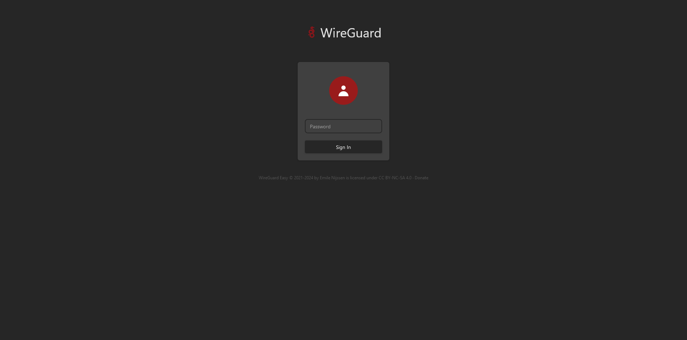
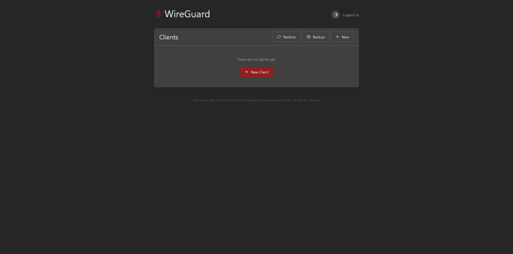

# How to setup a Minecraft Server using WireGuard
<h2>Disclaimer  </h2>

> This guide is intended to provide information and guidance on how to setup a private Minecraft server using WireGuard. Every effort has been made to ensure that the information presented in this guide is as accurate as possible. Despite this, it is possible that some information in this guide may be inaccurate. So do it at your own risk. I encourage people reading this guide to consult relevant online sources to enhance the guides accuracy and maybe learn more along the way.
## Introduction
In this guide, I will cover how to create a private Minecraft server using [WireGuard Easy](https://github.com/wg-easy/wg-easy). This guide is meant for private Minecraft servers, using WireGuard to host a public Minecraft server is not recommended as there are better methods to achieve that. If you are looking to host a public Minecraft server, consider hosting with a [VPS](https://en.wikipedia.org/wiki/Virtual_private_server). This guide will cover everything from configuring the operating system, setting up wg-easy for split tunnelling, and deploying the Minecraft server.
### Purpose & Motivation
I utilized WireGuard for a project when I was developing [StorageSolution](https://github.com/ShiroTohu/StorageSolution). **StorageSolution** was a full-stack application developed for an assignment. It allowed the contents of chests to be accessed by players in my private Minecraft server. I did not want to expose this application to the internet, especially because the API was implemented very poorly. So I utilized WireGuard to allow only a select few to access the API.

WireGuard has now become my preferred way to host Minecraft servers with my friends as it grants an extra layer of security and piece of mind.
### Target Audience
I wrote this guide with the main purpose of documenting the process. If you are a beginner to networking, make sure you do your due diligence and understand what you are doing and why. I try and explain things as best I can but I don't go through absolutely everything. The internet is your friend when it comes to these things.
### Hardware Requirements
There are many different ways you could set up your VPN and topologies you could choose from. But they usually come down to these components.
 - Computer to act as the WireGuard [gateway](https://en.wikipedia.org/wiki/Default_gateway) (Usually a Linux based system)
 - Computer for the Minecraft server
 - Micro SD Card / USB Drive (to install Linux)
You could combine the gateway and Minecraft server if needed as the performance impacts of the gateway are negligible.
## Setting Up the Gateway
For our gateway we will be using [wg-easy](https://github.com/wg-easy/wg-easy) on a Debian based distro. This will provide us a nice web UI to manage our connections remotely and make it more easier to download configuration files. wg-easy also configures WireGuard out of the box as well.

Some things to consider if you are planning to do this on either Windows or Mac:
- If you are on Windows consider using [WSL](https://learn.microsoft.com/en-us/windows/wsl/install) which allows you to use Linux applications directly on windows. This will allow you to follow the guide more closely.
- If you are on Windows or Mac you could also virtualize Linux using [VirtualBox](https://www.virtualbox.org/). This allows you to run a "guest machine" on top of your existing "host machine". You can follow this [guide](https://ubuntu.com/tutorials/how-to-run-ubuntu-desktop-on-a-virtual-machine-using-virtualbox#1-overview) to get started.
	- Make sure to use a bridged adapter to make the computer accessible on your LAN network if you want to SSH.
	- Make sure that you have virtualization enabled on your computer.
	- Make sure that you are using the server image instead of the desktop image to save some performance.
### Installing Linux and Dependencies
For running the gateway I recommend [Ubuntu Server](https://ubuntu.com/download/server) due to it's wide enterprise use. If you are running on a Raspberry Pi I recommend [Raspberry Pi OS](https://www.raspberrypi.com/software/) and flashing the iso file using the [Raspberry Pi Imager](https://www.raspberrypi.com/software/). Though, any Debian based distro should suffice. 

You can flash the operating system onto a USB Drive or SD Card using [Balena Etcher](https://etcher.balena.io/) or [Rufus](https://rufus.ie/en/). Then plug it into the computer your want the operating system to be on. Boot into the BIOS or UEFI Firmware Settings and find the USB to boot from.

- If it asks you to update the installer it usually is a good idea to do so. You get the latest security and such. I also like to search for third-party drivers in case for some reason you need a driver for something on your computer.
- You can encrypt the LVM group using LUKS, I like doing that because it adds that little bit of extra security.
- No big deal what names you choose, just choose a strong password.
- You can enable SSH during the install process. This allows you to remotely connect to your server using a username or password. It is quite useful to have set up. I'll be showing how to enable SSH and connect to it later through the terminal if you are unsure.
- **DO NOT INSTALL DOCKER** from the snap repository, we'll be doing it a different way later.  
- Reboot! Remove installation medium then press ENTER!

Here we install some dependencies for later. Make sure to install these otherwise some commands used later wont work
```
sudo apt update && sudo apt upgrade
sudo apt install net-tools git wireguard-tools
```
### Enabling SSH (Optional)
If you haven't enabled SSH on your system follow these instructions. Install `openssh-server` and allow SSH connections through the firewall then enable it. if you are unsure whether SSH is already running on your system you can check it with `systemctl status ssh`.
```
sudo apt install openssh-server
sudo ufw allow ssh
sudo systemctl enable ssh
```
You can check if SSH is all ready to go by typing this command.
```
systemctl status ssh
```
You can find the IP address of the server using `ifconfig`. The IP address for the server can be seen right after `inet`. You can then use this information to login using the following format below. You will be prompted to type in your password after you execute this command. This command is used to access the server remotely on a separate machine.
```
ssh <username>@<server_ip_address>
```
### Installing Docker
If you haven't installed Docker yet here is how you can do it via the command line. The first line installs docker using modified [docker-install](https://github.com/docker/docker-install) command. It then adds the current user to the docker group. It gets the current user using the `whoami` shell command.
```
curl -sSL https://get.docker.com | sh
sudo usermod -aG docker $(whoami)
exit
```
### Install wg-easy
First we need to clone the repository, we only really want the `docker-compose.yml` file as we will be editing it for the install. We also change into that directory.
```
git clone https://github.com/wg-easy/wg-easy.git
cd wg-easy
```
We first need to generate a password hash. We can use the wg-easy hashing tool to make this process easier. I have modified the command from the [wg-password wiki page](https://github.com/wg-easy/wg-easy/blob/master/How_to_generate_an_bcrypt_hash.md) to replace $ symbols with \$\$ and start with a dash. 
```
# if you are doing this manually
docker run --rm -it ghcr.io/wg-easy/wg-easy wgpw 'YOUR_PASSWORD'

# if you don't mind copy and pasting
docker run --rm -it ghcr.io/wg-easy/wg-easy wgpw 'YOUR_PASSWORD' | sed -e 's/\$/\$\$/g' -e 's/^/- /' -e 's/\'//'
```
We also need to save it somewhere as we will be making changes to `docker-compose.yml`. If you are using SSH, save it to the clipboard. If you are doing this from the terminal without SSH it's a bit harder. The way I found is to append the output of the command to the end of `docker-compose.yml` and moving it 37 lines up using a text editor. You can append to the end of the docker compose file by adding ` >> docker-compose.yml` to the end of the command .

Next Open up a text editor using `nano` or whatever you want. Use `vim` if you want a challenge ദ്ദി(˵ •̀ ᴗ - ˵ ) ✧.
```
nano docker-compose.yml
```
Paste in your password hash from the previous step. under the `# Optional` comment in the `docker-compose.yml` file. The command doesn't work out of the box for docker-compose so some changes need to be made.
- Remove the `'` at the beginning and end of the password hash
- Change `$` to `$$`
- Don't forget the `-` at the beginning
This is what a correct password hash should look like.
```
- PASSWORD_HASH=$$2y$$10$$hBCoykrB95WSzuV4fafBzOHWKu9sbyVa34GJr8VV5R/pIelfEMYyG
```
Change all other configurations in the compose file to the ones listed below.
```
- LANG=en # if it isn't already that by default.
- WG_POST_UP=/etc/wireguard/postup.sh
- WG_POST_DOWN=/etc/wireguard/postdown.sh
- WG_ALLOWED_IPS=10.8.0.0/24
```
As an optional step you can change the VPN's subnet IP, currently it is `10.8.0.X` but it can be anything you want it to be for e.g. `10.18.12.X`. I would recommend keeping the 10 at the beginning to avoid conflicts with other networks you might be connected to. To make these changes you need to change two environment variables.
```
- WG_DEFAULT_ADDRESS=10.X.X.X
- WG_ALLOWED_IPS=10.8.0.0/24
```
LGTM! let's deploy the docker container.
```
docker compose up --detach
```
You don't need the `wg-easy` folder cloned from the repo anymore to delete it.
```
cd
rm -fr wg-easy/
```
Now if you go in a web browser and type the LOCAL IP address of the server with the port `51821` you should be greeted with a page like this. 

Just log in and how you are on the configuration page where you can add new connections/clients, download config files etc.

### Creating the Firewall using Iptables
If we setup WireGuard out of the box with no firewall rules, there is nothing stopping clients from accessing our LAN network. Traffic from their device can be masqueraded by our home network as their traffic is sent out through our gateway.

Before we Install wg-easy we should get setup some files in `etc/wireguard/`, this will just make it a little bit more easier to manage your firewall down the road if you need it. We will be creating two files `postup.sh` and `postdown.sh`.  In essence, these two scripts will be ran when setting up and tearing down the interface.

shell into the docker container using the following command. `<container>` is the container from the `docker ps` command.
```
docker ps
docker exec -it <container> sh
```

`etc/wireguard/` is a protected folder and therefore needs sudo privilege's to access. To log into the sudo user type the following command. The folder won't show up if you don't have `wireguard-tools` installed.

```
sudo -i
```
Create these two files using `nano` or your favourite text editor and replace the X with the corresponding number in your local network. This can be found out using `ifconfig`.
```
# /etc/wireguard/postup.sh
iptables -I FORWARD -i wg0 -d 192.168.X.0/24 -j REJECT 
iptables -t nat -A POSTROUTING -o eth0 -j MASQUERADE
```
`postup.sh` is responsible for setting up the firewall when the interface is setup.
- All packets that are FORWARDED through the wg0 interface (The VPN) with a destination address of somewhere in your local network (192.168.X.0) are REJECTED.
```
# /etc/wireguard/postdown.sh
iptables -D FORWARD -i wg0 -d 192.168.X.0/24 -j REJECT 
iptables -t nat -D POSTROUTING -o eth0 -j MASQUERADE
```
`postdown.sh` tears down all the rules setup by the `postup.sh` script. The reason why we don't just flush all the rules out of Iptables is that `wg-easy` has some rules of their own that I wouldn't want to touch. You can see these rules if you type `sudo iptables --list`

```
chmod +x /etc/wireguard/postup.sh /etc/wireguard/postdown.sh
```
I recommend running these and checking if they work using iptables. 
```
iptables --list
iptables --table nat --list
```
Don't forget to exit out of sudo with the `exit` command once you are done.
### Port Forwarding
Port forwarding is different for everyone as different routers have different gateways. You can find the default gateway of your network using `ipconfig` on windows, `route -n get default` on mac and `ip route` on Linux.

You use this IP address to log into your router, usually it is `192.168.0.1`, you need to find the port forwarding section and add these rules.
- Original Port 51820
- Forward to Port 51820
- Protocol TCP/UDP
- Forward to Address is the LAN address of the WireGuard Server.
- Description can be anything you want
Make sure to save these rules.

> [!WARNING]
> Some Internet providers utilize [**Carrier-grade NAT**](https://en.wikipedia.org/wiki/Carrier-grade_NAT). This means that you modem is assigned a private IP address instead of a unique public IP address. In summary, you cannot port forward behind a CG-NAT as the firewall is configured by the ISP. To remedy this you can contact your ISP about changing to a dynamic IP address to make your IP public again.
## Setting up the Minecraft Server
### Sending over the config file
You can send over the config file using the `scp` command which stands for "secure copy protocol" and NOT "Secure, Contain, Protect".
## Connecting to WireGuard
```
wg-quick up CONFIG_NAME
```
### Installing Java
We will be using PaperMC for this guide, this is just personal preference.

## Uninstalling
Say you changed your mind.

---
If you found this guide useful please leave a star!
